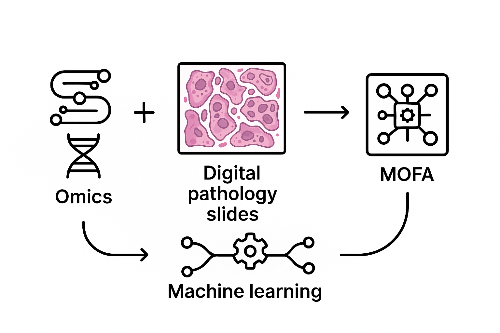

# PathOmix


    
## Project Description


This project proposes a pipeline that integrates multi-omics data with pathologic features extracted from histopathology slides. The pathology features can be derived either using foundation models (deep learning representations) or using standard image analysis features. The goal is to enable comprehensive factor analysis that jointly models molecular and imaging data to uncover meaningful biological insights.


## Configuration

This document describes the fields in the `config.yml` configuration file used to run the MOFA2 multi-omics factor analysis pipeline.

---

## Configuration Fields

| **Field**                 | **Description**                                                                                      | **Example / Dummy Value**                          |
|---------------------------|--------------------------------------------------------------------------------------------------|---------------------------------------------------|
| `conda_env`               | Name of the Conda environment where all dependencies (Python, R, MOFA2) are installed.            | `"mofa2_env"`                                     |
| `python_path`             | Full path to the Python executable within the Conda environment.                                  | `"/path/to/conda/envs/mofa2_env/bin/python3"`    |
| `r_path`                  | Full path to the Rscript executable within the Conda environment.                                 | `"/path/to/conda/envs/mofa2_env/bin/Rscript"`    |
| `input_dir`               | Directory containing input data files.                                                           | `"./input"`                                       |
| `clinical_file`           | Path to the CSV file with clinical data used in analysis.                                         | `"./input/clinical_data.csv"`                      |
| `continuous_predictors`   | List of continuous clinical variables used for correlation testing.                               | `["age", "egfr_latest", "serum_creatinine"]`      |
| `categorical_predictors`  | List of categorical clinical variables used for group comparison tests (e.g., Kruskal-Wallis).    | `["aki_status", "disease_type", "gender", "diabetes_yes_no", "diabetes_type"]` |
| `files`                   | List of input omics or pathomics data files (CSV format).                                        | `["slide_features_A.csv", "slide_features_B.csv", "plasma_data.csv"]`            |
| `view_names`              | Names assigned to each data view corresponding to `files`.                                      | `["slide_A", "slide_B", "plasma"]`                 |
| `output_dir`              | Directory where output files (models, plots, tables) will be saved.                              | `"./results/experiment_1"`                          |
| `output_file`             | Path to save the trained MOFA2 model file (.hdf5).                                               | `"./results/experiment_1/model.hdf5"`               |
| `output_plot`             | Path to save the main variance explained plot (PDF).                                            | `"./results/experiment_1/variance_explained.pdf"`  |
| `output_plot2`            | Path to save additional factor-related plots (PDF).                                             | `"./results/experiment_1/factors_plot.pdf"`        |
| `factors_filtered`        | CSV file path where filtered factor values will be saved.                                       | `"./results/experiment_1/factors_filtered.csv"`    |
| `output_correlation_file` | CSV file path to save correlation significance results for continuous predictors.                | `"./results/experiment_1/correlation_significance.csv"` |
| `output_correlation_file2`| CSV file path to save significance results for categorical predictors.                          | `"./results/experiment_1/categorical_significance.csv"` |

---

## Notes

- Paths can be relative or absolute. Ensure the directories exist or are created by the pipeline.
- The `files` and `view_names` lists must match in order and length.
- Clinical predictor variables must correspond exactly to column names in the clinical CSV.
- This config controls environment setup, input/output locations, and variable names for analysis.

---

## Example

```yaml
conda_env: "mofa2_env"
python_path: "/path/to/conda/envs/mofa2_env/bin/python3"
r_path: "/path/to/conda/envs/mofa2_env/bin/Rscript"
input_dir: "./input"
clinical_file: "./input/clinical_data.csv"
continuous_predictors:
  - age
  - egfr_latest
  - serum_creatinine
categorical_predictors:
  - aki_status
  - disease_type
  - gender
  - diabetes_yes_no
  - diabetes_type
files:
  - slide_features_A.csv
  - slide_features_B.csv
  - plasma_data.csv
view_names:
  - slide_A
  - slide_B
  - plasma
output_dir: "./results/experiment_1"
output_file: "./results/experiment_1/model.hdf5"
output_plot: "./results/experiment_1/variance_explained.pdf"
output_plot2: "./results/experiment_1/factors_plot.pdf"
factors_filtered: "./results/experiment_1/factors_filtered.csv"
output_correlation_file: "./results/experiment_1/correlation_significance.csv"
output_correlation_file2: "./results/experiment_1/categorical_significance.csv"
```

## Usage

After preparing your configuration file (e.g., `config.yml`), run the pipeline with the following command:

```bash
python run_mofa.py --config config.yml
```